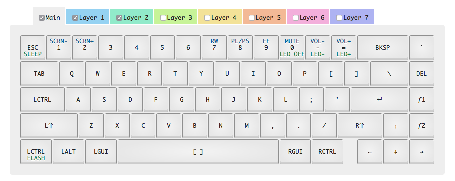

# WhiteFox Layout

The layout for my [WhiteFox](https://www.massdrop.com/buy/the-whitefox-keyboard) keyboard. 

Configured using [input club's configurator](https://input.club/configurator-whitefox/).

## Flashing Hardware

- `brew install dfu-util`
- Press the flash button on the back of the keyboard.
- `$ dfu-util -D kiibohd.dfu.bin` 

## Current Layout

